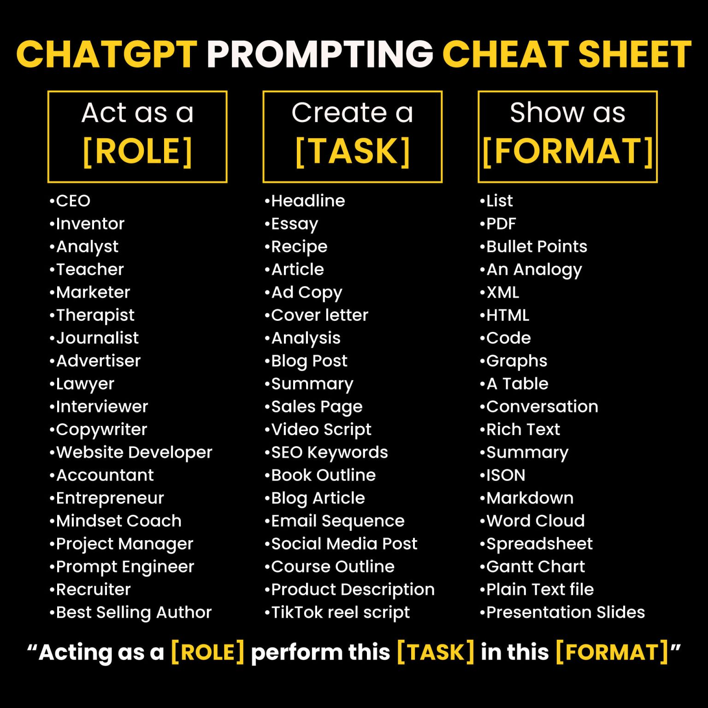
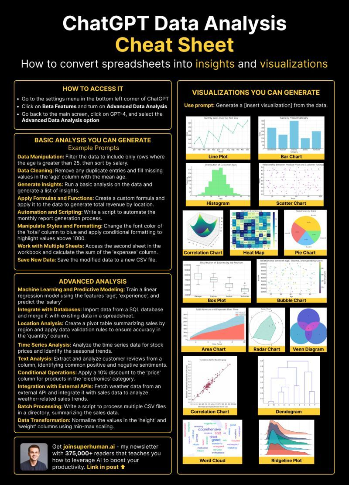
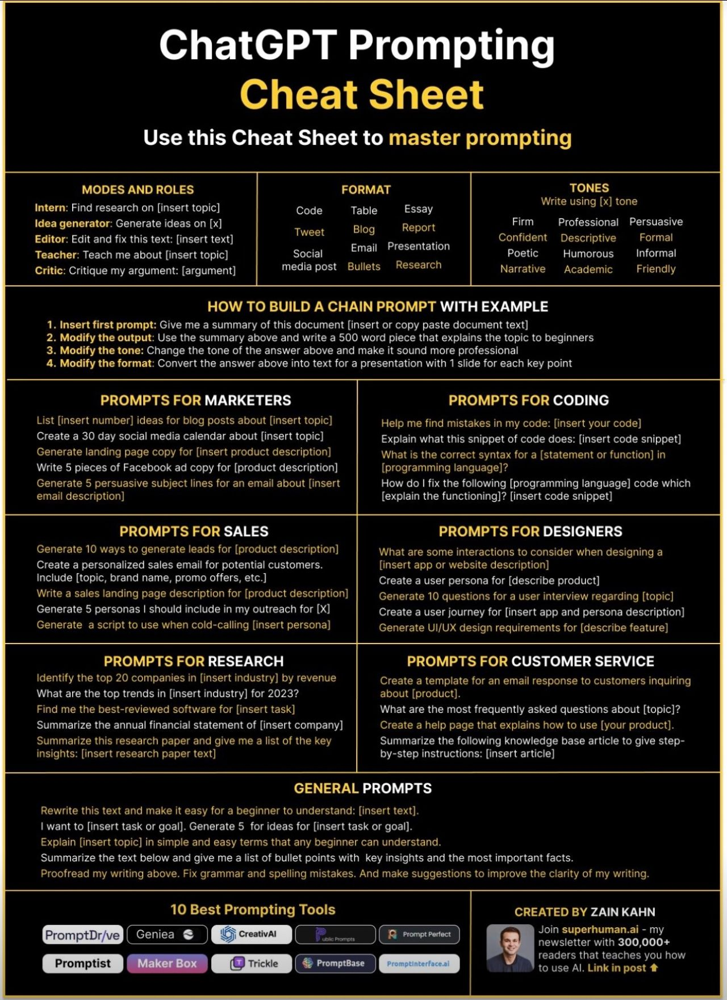
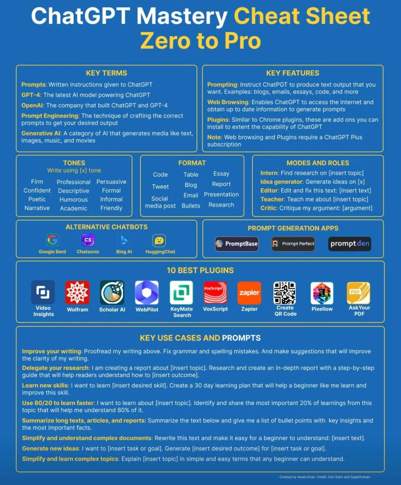

### Additional Resources for Prompt Techniques

While creating this content I spent time gathering information from a wide range of resources. I want to attribute where I can. I've also included a collection of Cheat Sheets and other One Pagers. These serve as an opportunity to create inspiration and also provide the benefit of a quick visual to remind us of the basics. 

Thought Leaders to follow:
- [Andrew Ng](https://www.linkedin.com/in/andrewyng/)
- [John Maeda](https://www.linkedin.com/in/johnmaeda/)
- [Steve Nouri](https://www.linkedin.com/in/stevenouri/)
- [Yann LeCun](https://www.linkedin.com/in/yann-lecun/)
- [Daphne Koller](https://www.linkedin.com/in/daphne-koller-4053a820/)
- [Lex Fridman](https://www.linkedin.com/in/lexfridman/)

Open AI Best Practices
[Google](https://www.google.com/)

PromptEngineering.AI
[Prompt Engineering Guide](https://www.promptingguide.ai/)

***Deeplearning.AI**

Please Note: These are short courses offered for free by Deeplearning.AI. These will likely disappear in the future. I'll try to keep this list accurate as the available course come and go. 

- [ChatGPT Prompt Engineering for Developers](https://learn.deeplearning.ai/chatgpt-prompt-eng/lesson/1/introduction)

- [Building Systems with the ChatGPT API](https://learn.deeplearning.ai/chatgpt-building-system/lesson/1/introduction)

- [Pair Programming with a Large Language Model](https://learn.deeplearning.ai/pair-programming-llm/lesson/1/introduction)

- [How Business Thinkers Can Start Building AI Plugins With Semantic Kernel](https://learn.deeplearning.ai/microsoft-semantic-kernel/lesson/1/introduction)

GitHub Links
-[A developer’s guide to prompt engineering and LLMs](https://github.blog/2023-07-17-prompt-engineering-guide-generative-ai-llms/)

[Dair AI - Prompt Engineering Guidee](https://github.com/dair-ai/Prompt-Engineering-Guide/blob/main/guides/prompts-intro.md)

LinkedIn Course
- [Introduction to Prompt Engineering for Generative AI](https://www.linkedin.com/learning/introduction-to-prompt-engineering-for-generative-ai/)

ArXiv Research Papers

- [Chain of Verification](https://arxiv.org/abs/2309.11495)

Cheet Sheets

- [Hamna Aslam Kahn - LinkedIn](https://www.linkedin.com/feed/update/urn:li:activity:7122557742166257665/)

- [Zain Kahn](https://www.linkedin.com/in/zainkahn/)

- [Huxley Peckham](https://www.linkedin.com/in/huxley-peckham/)

- [Awais Khan](https://www.linkedin.com/in/awaiskhanli/)

